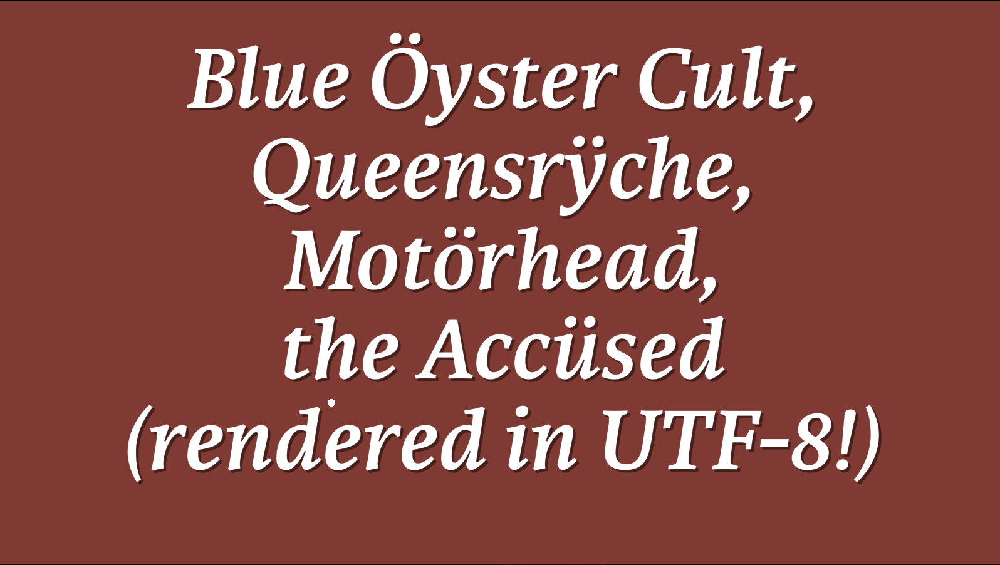
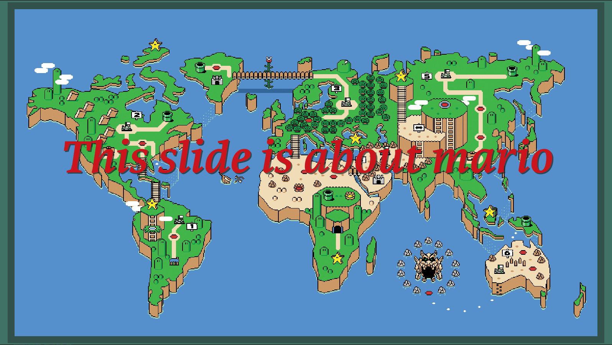
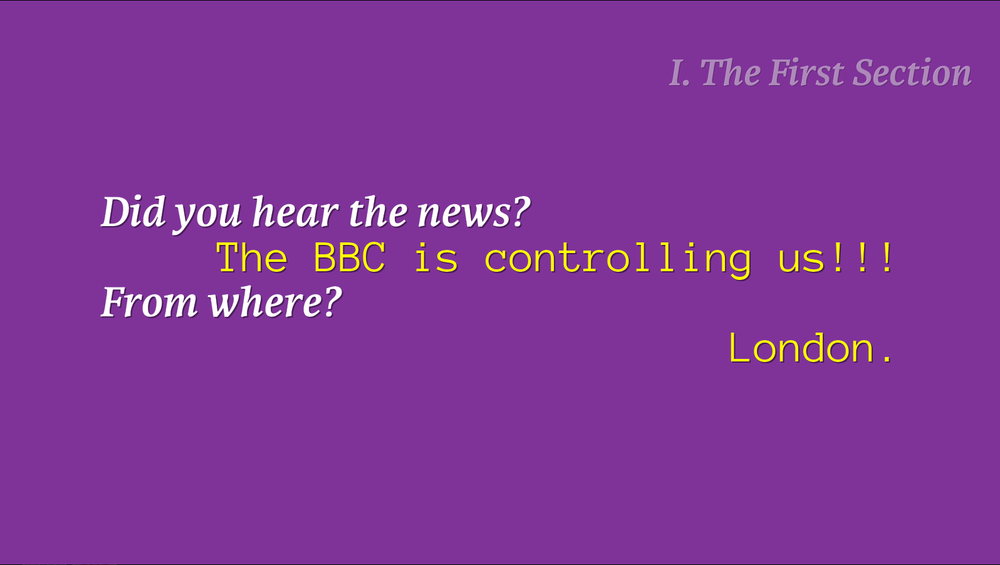
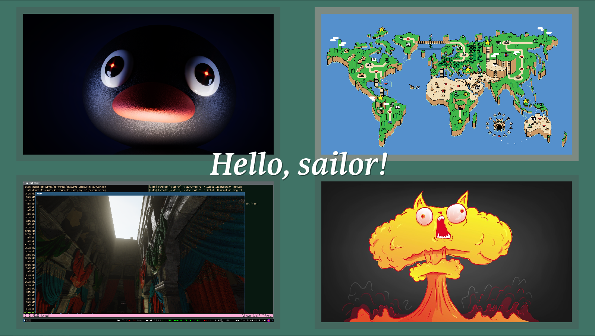
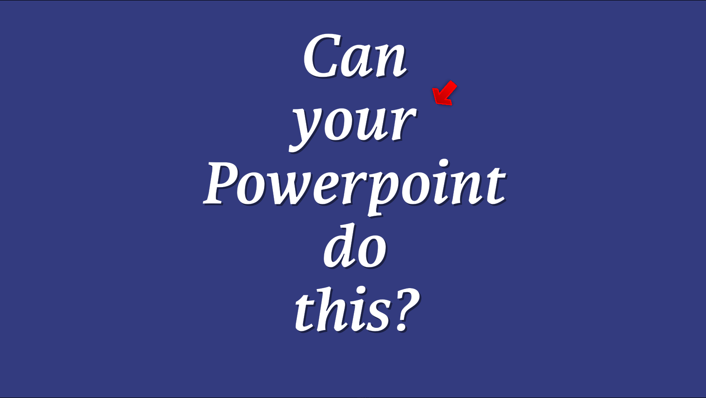

# Slideshow program.

The slideshow program is in OpenGL and heavily relies on the Linux environment. I'm using Ubuntu 24.04 LTS to develop it.

It uses an older version of the engine in the block pushing game I made.

Some of the features includes:

- Custom text format for slideshows.
- Ability to load compressed textures (s3tc).
- Ability to have GUI for editing stuff (not maturely developed yet, although the UI system is pretty mature because it is forking from the block pushing game's editor).
- Timer for presenter mode, (double screen for viewer/presenter is being developed).
- Dumping slides as screenshots to a folder (useful for giving out your presentation to other people).
- Different cursor options (ball, arrow, and probably something else that I don't remember).
- Freetype, of course, with the ablitiy to display UTF-8 characters just like in the other game.
- Oh, also, it is packaged with a data folder, which contains fonts that you could drag and drop to, so it does not depend on the operating system's fonts. This is something that is better than Powerpoint, because Powerpoint does not guarantees the consistent behaviour across different machines.
- I'm not actively developing this program right now, in part because I'm dedicating my time doing the block pushing game, but it is occasionally being developed when I need to give presentations.

